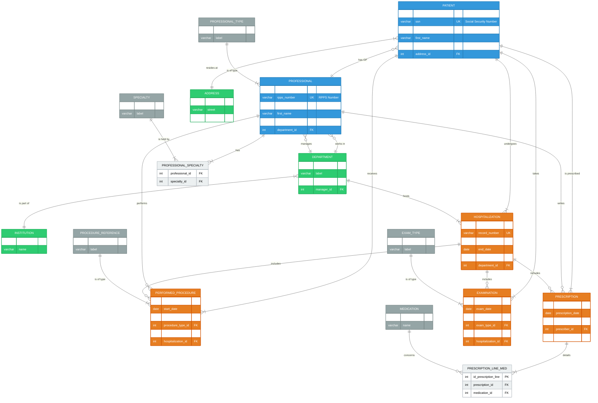

<div align="right">
  <a href="./README.md">English</a> |
  <a href="./README_fr.md">Français</a> |
  <a href="./README_es.md">Español</a>
</div>

# Oracle Database for a National Electronic Health Record (EHR) System


An end-to-end Oracle database project for a national EHR system, covering conceptual design, physical implementation (3NF), data population, and functional validation with SQL/PL-SQL queries.

### Database Schema Diagram (High-Level View)

**Note on Naming Conventions:** For clarity and accessibility to an international audience, this ERD uses English names for tables and attributes. The actual implementation in the `.sql` scripts uses French naming conventions (e.g., `PROFESSIONNEL` instead of `PROFESSIONAL`).



> **For a detailed analysis of the complete schema with all 46 tables, please consult the [Project Wiki](https://github.com/Alespfer/DMI-Oracle-Database-Architecture-for-a-National-Health-Record-System/wiki/Database-Design-and-Modeling).**

## Table of Contents
- [About The Project](#about-the-project)
- [Schema Highlights & Design Choices](#schema-highlights--design-choices)
- [Technical Stack](#technical-stack)
- [Getting Started](#getting-started)
- [Example Queries](#example-queries)
- [License](#license)
- [Contact](#contact)

## About The Project
Developed as part of a university curriculum at Université Paris Cité, this project's goal was to build the data infrastructure for a national EHR. The challenge was to translate complex business requirements from the healthcare domain into a highly normalized, coherent, and efficient relational database model, implemented on an Oracle RDBMS.

## Schema Highlights & Design Choices
-   🏛️ **High Normalization (3NF):** The schema is meticulously broken down into 46 tables to eliminate data redundancy and prevent update anomalies. Referential tables centralize medical terminologies, ensuring data consistency.
-   🔑 **Artificial Primary Keys:** Systematic use of sequences to generate numeric primary keys decouples internal identifiers from business identifiers, ensuring model stability and optimizing join performance.
-   🔗 **Strict Referential Integrity:** The model is heavily constrained with `PK`, `FK`, `UK`, and `CHECK` constraints to enforce data integrity and business rules at the database level.
-   🗄️ **Physical Data Segregation:** The use of two distinct tablespaces (`DATA_DMI` for data, `INDEX_DMI` for indexes) is an advanced Oracle practice implemented to optimize disk I/O performance.
-   🔄 **Transactional Integrity:** Data insertion scripts are encapsulated within transactional PL/SQL blocks, guaranteeing the atomicity of operations with `COMMIT` and `ROLLBACK` logic.

## Technical Stack
-   **RDBMS:** Oracle Database
-   **Languages:** SQL, PL/SQL
-   **Administration:** SQL*Plus, SQL Developer

## Getting Started
To recreate this database schema on your own Oracle instance, follow these steps.

### Prerequisites
-   An Oracle Database instance (e.g., Express Edition 21c).
-   A SQL client (e.g., SQL*Plus, SQL Developer).
-   A user with `SYS` or `DBA` privileges for the initial setup.

### Installation
The scripts must be executed in a specific order:
1.  **Connect as `SYS` or `DBA`** to your database.
2.  **Execute the setup scripts:**
    -   `create_schema.sql`: Creates the `DMI_APP` user and grants privileges.
    -   `create_tbs.sql`: Creates the dedicated tablespaces.
3.  **Connect as the `DMI_APP` user.**
4.  **Execute the object and data scripts:**
    -   `create_table.sql`: Creates all sequences, tables, and constraints.
    -   `insert_tables.sql`: Populates the database with a consistent set of test data.
    -   `exploitation.sql`: Contains queries to validate and demonstrate the model's capabilities.

## Example Queries
The `exploitation.sql` script showcases the database's potential. Here are a few key examples that demonstrate its practical use.

### 1. Generating a Complete Patient Record Summary (PL/SQL)
A key requirement for an EHR is to generate a comprehensive, readable summary of a patient's entire record. A PL/SQL block was used to procedurally fetch and format the information section by section, demonstrating advanced data aggregation and presentation skills.

<details>
<summary>Click to view the PL/SQL code for generating the patient summary</summary>

```sql
DECLARE
    v_pid           PATIENT.id_patient%TYPE;
BEGIN
    -- Step 1: Find the patient's ID by name
    SELECT id_patient
    INTO   v_pid
    FROM   PATIENT
    WHERE  nom = 'DURANT'
      AND  prenom = 'Philippe';

    -- Step 2: Fetch and display administrative information
    DBMS_OUTPUT.PUT_LINE('--- Administrative Information ---');
    FOR rec_pat IN (
        SELECT p.numero_ss, p.nom, p.prenom,
               TO_CHAR(p.date_naissance,'DD/MM/YYYY') AS dt_naiss, p.ville_naissance,
               a.rue || ', ' || a.code_postal || ' ' || a.ville AS adresse_residence,
               mt.nom || ' ' || mt.prenom AS medecin_traitant_nom
        FROM   PATIENT p
        LEFT JOIN ADRESSE a        ON p.id_adresse = a.id_adresse
        LEFT JOIN PROFESSIONNEL mt ON p.id_medecin_traitant = mt.id_professionnel
        WHERE  p.id_patient = v_pid
    ) LOOP
        DBMS_OUTPUT.PUT_LINE('SSN             : '|| rec_pat.numero_ss);
        DBMS_OUTPUT.PUT_LINE('Name            : '|| rec_pat.nom ||' '|| rec_pat.prenom);
        DBMS_OUTPUT.PUT_LINE('Date of Birth   : '|| rec_pat.dt_naiss || ' in ' || rec_pat.ville_naissance);
        DBMS_OUTPUT.PUT_LINE('Address         : '|| rec_pat.adresse_residence);
        DBMS_OUTPUT.PUT_LINE('Primary Doctor  : '|| rec_pat.medecin_traitant_nom);
    END LOOP;

    -- Step 3: Fetch and display hospitalization history
    DBMS_OUTPUT.PUT_LINE(chr(10) || '--- Hospitalization History ---');
    FOR rec IN (
        SELECT h.num_dossier,
               TO_CHAR(h.date_debut,'DD/MM/YYYY') AS deb,
               TO_CHAR(h.date_fin,'DD/MM/YYYY')   AS fin,
               h.motif,
               s.libelle AS service
        FROM   HOSPITALISATION h
        JOIN   SERVICE s ON s.id_service = h.id_service
        WHERE  h.id_patient = v_pid
        ORDER  BY h.date_debut DESC
    ) LOOP
        DBMS_OUTPUT.PUT_LINE(rec.num_dossier||' | '||rec.deb||' -> '||NVL(rec.fin,'ONGOING')||
                             ' | '||rec.service||' | '||rec.motif);
    END LOOP;

    -- Step 4: Fetch and display medical history and active diagnoses
    DBMS_OUTPUT.PUT_LINE(chr(10) || '--- Medical History & Active Diagnoses ---');
    FOR rec IN (
        SELECT 'HISTORY' AS type, a.description AS label, a.date_debut AS dt
        FROM   ANTECEDENT a
        WHERE  a.id_patient = v_pid
        UNION ALL
        SELECT 'DIAGNOSIS', pth.libelle, d.date_diagnostic
        FROM   DIAGNOSTIC_PATHOLOGIE d
        JOIN   PATHOLOGIE pth ON pth.id_pathologie = d.id_pathologie
        WHERE  d.id_patient = v_pid
          AND  d.statut = 'Actif'
    ) LOOP
        DBMS_OUTPUT.PUT_LINE(rec.type||' - '||rec.label||' ('||TO_CHAR(rec.dt,'DD/MM/YYYY')||')');
    END LOOP;
END;
/
```
</details>

**Example Output:**

```text
--- Administrative Information ---
SSN             : 1750375123456
Name            : DURANT Philippe
Date of Birth   : 20/03/1975 in Lyon
Address         : 10 Rue de Rivoli, 75004 Paris
Primary Doctor  : LEROY Bernard

--- Hospitalization History ---
HOSP-PD-2025-005 | 26/10/2024 -> ONGOING | Medecine Interne | Persistent post-meal abdominal pain
HOSP-PD-2023-001 | 10/05/2023 -> 12/05/2023 | Chirurgie Viscerale | Uncomplicated acute appendicitis
HOSP-PD-2010-007 | 01/06/2010 -> 03/06/2010 | Chirurgie Viscerale | Symptomatic gallbladder stones

--- Medical History & Active Diagnoses ---
HISTORY - Cholecystectomy (gallbladder removal) (01/06/2010)
DIAGNOSIS - Essential hypertension (20/09/2018)
```

### 2. Retrieve Medications Prescribed During a Specific Hospital Stay
This query demonstrates how the model links a patient, a hospitalization, prescriptions, and medications together.

```sql
SELECT lp.posologie, m.nom, m.dosage_unitaire
FROM   PATIENT p
JOIN   HOSPITALISATION h ON h.id_patient = p.id_patient
JOIN   PRESCRIPTION pr   ON pr.id_hospitalisation = h.id_hospitalisation
JOIN   LIGNE_PRESCRIPTION_MEDICAMENT lp ON lp.id_prescription = pr.id_prescription
JOIN   MEDICAMENT m ON m.id_medicament = lp.id_medicament
WHERE  p.nom='DURANT'
  AND  h.num_dossier='HOSP-PD-2023-001';
```

## License
Distributed under the MIT License. See `LICENSE` for more information.

## Contact
Project by **Alberto ESPERÓN** 
-   Alberto ESPERÓN - [LinkedIn](https://www.linkedin.com/in/alberto-espfer) - [GitHub](https://github.com/Alespfer)
