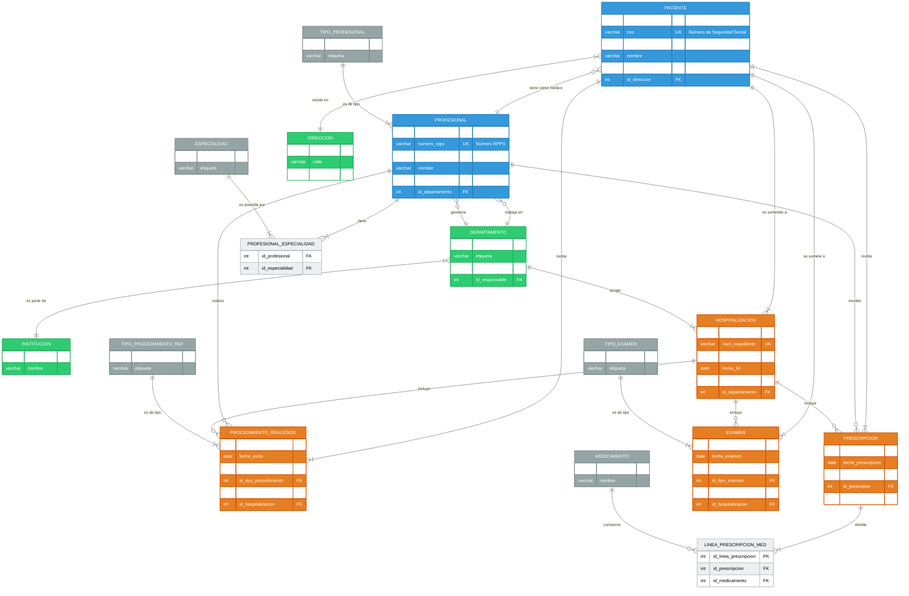

<div align="right">
  <a href="./README.md">English</a> |
  <a href="./README_fr.md">Français</a> |
  <a href="./README_es.md">Español</a>
</div>

# Base de Datos Oracle para un Sistema Nacional de Historia Clínica Electrónica (HCE)


Un proyecto de base de datos Oracle de principio a fin para un sistema nacional de HCE, que abarca el diseño conceptual, la implementación física (3FN), la carga de datos y la validación funcional con consultas SQL y PL/SQL.

### Diagrama del Esquema de la Base de Datos (Vista General)

**Nota sobre las convenciones de nomenclatura:** Para mayor claridad y accesibilidad a una audiencia hispanohablante, este diagrama ERD utiliza nombres en español para las tablas y atributos. Es importante tener en cuenta que la implementación real en los scripts `.sql` utiliza la nomenclatura original en francés (p. ej., `PATIENT` en lugar de `PACIENTE`, `date_naissance` en lugar de `fecha_nacimiento`).



> **Para un análisis detallado del esquema completo con sus 46 tablas, por favor consulte la [Wiki del Proyecto](https://github.com/Alespfer/DMI-Oracle-Database-Architecture-for-a-National-Health-Record-System/wiki/Diseño-y-modelado-de-la-base-de-datos).**

## Índice
- [Sobre el Proyecto](#sobre-el-proyecto)
- [Aspectos Destacados del Esquema y Decisiones de Diseño](#aspectos-destacados-del-esquema-y-decisiones-de-diseño)
- [Stack Tecnológico](#stack-tecnológico)
- [Instalación y Uso](#instalación-y-uso)
- [Consultas de Ejemplo](#consultas-de-ejemplo)
- [Licencia](#licencia)
- [Contacto](#contacto)

## Sobre el Proyecto
Desarrollado en la Université Paris Cité, el objetivo de este proyecto fue construir la infraestructura de datos para una HCE nacional. El desafío fue traducir los complejos requisitos del dominio sanitario en un modelo relacional altamente normalizado, coherente y eficiente en un SGBD Oracle.

## Aspectos Destacados del Esquema y Decisiones de Diseño
-   🏛️ **Alta Normalización (3FN):** El esquema se descompone en 46 tablas para eliminar la redundancia y prevenir anomalías. Las tablas de referencia centralizan la terminología.
-   🔑 **Claves Primarias Artificiales:** El uso de secuencias para las claves primarias desacopla los identificadores técnicos y de negocio, asegurando la estabilidad y el rendimiento.
-   🔗 **Integridad Referencial Estricta:** El modelo está fuertemente restringido con `PK`, `FK`, `UK` y `CHECK` para reforzar la integridad de los datos a nivel de la base de datos.
-   🗄️ **Segregación Física de Datos:** El uso de dos `tablespaces` (`DATA_DMI` para datos, `INDEX_DMI` para índices) es una práctica avanzada para optimizar la E/S de disco.
-   🔄 **Integridad Transaccional:** Los scripts de inserción están encapsulados en bloques PL/SQL, garantizando la atomicidad de las operaciones con `COMMIT` y `ROLLBACK`.

## Stack Tecnológico
-   **SGBD:** Oracle Database
-   **Lenguajes:** SQL, PL/SQL
-   **Administración:** SQL*Plus, SQL Developer

## Instalación y Uso
Para recrear este esquema, siga estos pasos.

### Prerrequisitos
-   Una instancia de Oracle (ej: Express Edition 21c).
-   Un cliente SQL (ej: SQL Developer).
-   Un usuario con privilegios `SYS` o `DBA`.

### Instalación
Los scripts deben ejecutarse en este orden:
1.  **Conéctese como `SYS` o `DBA`**.
2.  **Ejecute los scripts de configuración:**
    -   `create_schema.sql`: Crea el usuario `DMI_APP`.
    -   `create_tbs.sql`: Crea los tablespaces.
3.  **Conéctese como `DMI_APP`**.
4.  **Ejecute los scripts de creación y carga:**
    -   `create_table.sql`: Crea todas las estructuras (tablas, restricciones, etc.).
    -   `insert_tables.sql`: Puebla la base con datos de prueba.
    -   `exploitation.sql`: Contiene consultas para validar el modelo.

## Consultas de Ejemplo
El script `exploitation.sql` demuestra las capacidades de la base. Aquí algunos ejemplos clave que ilustran su uso práctico.

### 1. Generar un Resumen Completo de la Historia Clínica (PL/SQL)
Un requisito clave de una HCE es generar un resumen completo y legible de la historia de un paciente. Se utilizó un bloque PL/SQL para obtener y formatear de manera procedural la información, demostrando habilidades avanzadas de agregación y presentación de datos.

<details>
<summary>Haga clic para ver el código PL/SQL que genera el resumen del paciente</summary>

```sql
DECLARE
    v_pid           PATIENT.id_patient%TYPE;
BEGIN
    -- Paso 1: Encontrar el ID del paciente por su nombre
    SELECT id_patient
    INTO   v_pid
    FROM   PATIENT
    WHERE  nom = 'DURANT'
      AND  prenom = 'Philippe';

    -- Paso 2: Obtener y mostrar la información administrativa
    DBMS_OUTPUT.PUT_LINE('--- Información Administrativa ---');
    FOR rec_pat IN (
        SELECT p.numero_ss, p.nom, p.prenom,
               TO_CHAR(p.date_naissance,'DD/MM/YYYY') AS dt_naiss, p.ville_naissance,
               a.rue || ', ' || a.code_postal || ' ' || a.ville AS adresse_residence,
               mt.nom || ' ' || mt.prenom AS medecin_traitant_nom
        FROM   PATIENT p
        LEFT JOIN ADRESSE a        ON p.id_adresse = a.id_adresse
        LEFT JOIN PROFESSIONNEL mt ON p.id_medecin_traitant = mt.id_professionnel
        WHERE  p.id_patient = v_pid
    ) LOOP
        DBMS_OUTPUT.PUT_LINE('N° Seg. Social  : '|| rec_pat.numero_ss);
        -- ... etc.
    END LOOP;
END;
/
```
</details>

**Ejemplo de Salida:**

```text
--- Información Administrativa ---
N° Seg. Social  : 1750375123456
Nombre          : DURANT Philippe
Fecha de Nac.   : 20/03/1975 en Lyon
Dirección       : 10 Rue de Rivoli, 75004 Paris
Médico          : LEROY Bernard

--- Historial de Hospitalizaciones ---
HOSP-PD-2025-005 | 26/10/2024 -> EN CURSO | Medecine Interne | Dolores abdominales...
HOSP-PD-2023-001 | 10/05/2023 -> 12/05/2023 | Chirurgie Viscerale | Apendicitis aguda...

--- Antecedentes y Diagnósticos Activos ---
ANTECEDENTE - Colecistectomía (extirpación de la vesícula biliar) (01/06/2010)
DIAGNÓSTICO - Hipertensión arterial esencial (20/09/2018)
```

### 2. Recuperar Medicamentos Recetados Durante una Estancia Hospitalaria
Esta consulta demuestra cómo el modelo vincula a un paciente, una hospitalización, recetas y medicamentos.

```sql
SELECT lp.posologie, m.nom, m.dosage_unitaire
FROM   PATIENT p
JOIN   HOSPITALISATION h ON h.id_patient = p.id_patient
JOIN   PRESCRIPTION pr   ON pr.id_hospitalisation = h.id_hospitalisation
JOIN   LIGNE_PRESCRIPTION_MEDICAMENT lp ON lp.id_prescription = pr.id_prescription
JOIN   MEDICAMENT m ON m.id_medicament = lp.id_medicament
WHERE  p.nom='DURANT'
  AND  h.num_dossier='HOSP-PD-2023-001';
```

## Licencia
Distribuido bajo la licencia MIT. Vea `LICENSE` para más información.

## Contacto
Proyecto realizado por **Alberto ESPERÓN**.
  
-   Alberto ESPERÓN - [LinkedIn](https://www.linkedin.com/in/alberto-espfer) - [GitHub](https://github.com/Alespfer)
