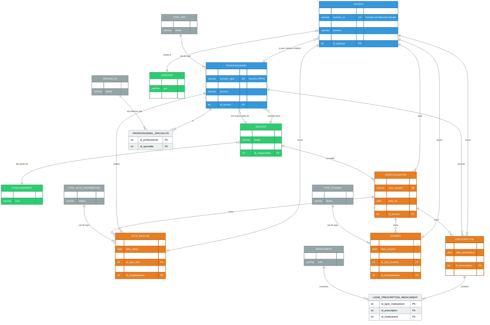

<div align="right">
  <a href="./README.md">English</a> |
  <a href="./README_fr.md">Français</a> |
  <a href="./README_es.md">Español</a>
</div>

# Base de Données Oracle pour un Dossier Médical Informatisé (DMI) National


Un projet de base de données Oracle de bout en bout pour un système national de DMI, couvrant la conception conceptuelle, l'implémentation physique (3NF), le peuplement des données et la validation fonctionnelle avec des requêtes SQL et PL/SQL.

### Diagramme du Schéma de la Base de Données (Vue d'Ensemble)



> **Pour une analyse détaillée du schéma complet et de ses 46 tables, veuillez consulter le [Wiki du projet](https://github.com/Alespfer/DMI-Oracle-Database-Architecture-for-a-National-Health-Record-System/wiki/Schéma-de-Données-Détaillé).**

## Table des Matières
- [À Propos du Projet](#à-propos-du-projet)
- [Points Forts du Schéma & Choix de Conception](#points-forts-du-schéma--choix-de-conception)
- [Stack Technique](#stack-technique)
- [Installation et Lancement](#installation-et-lancement)
- [Exemples de Requêtes](#exemples-de-requêtes)
- [Licence](#licence)
- [Contact](#contact)

## À Propos du Projet
Réalisé à l'Université Paris Cité, ce projet visait à construire l'infrastructure de données d'un DMI national. Le défi consistait à traduire les exigences du domaine de la santé en un modèle relationnel hautement normalisé, cohérent et performant sur un SGBD Oracle.

## Points Forts du Schéma & Choix de Conception
-   🏛️ **Normalisation Poussée (3NF) :** Le schéma est décomposé en 46 tables pour éliminer la redondance et prévenir les anomalies. Des tables de référence centralisent les nomenclatures.
-   🔑 **Clés Primaires Artificielles :** L'usage de séquences pour les clés primaires découple les identifiants techniques et métier, assurant la stabilité et la performance des jointures.
-   🔗 **Intégrité Référentielle Stricte :** Le modèle est fortement contraint par des `PK`, `FK`, `UK`, et `CHECK` pour renforcer l'intégrité des données au niveau de la base.
-   🗄️ **Ségrégation Physique des Données :** L'emploi de deux `tablespaces` (`DATA_DMI` pour les données, `INDEX_DMI` pour les index) est une pratique avancée visant à optimiser les I/O disque.
-   🔄 **Intégrité Transactionnelle :** Les scripts d'insertion sont encapsulés dans des blocs PL/SQL, garantissant l'atomicité des opérations avec `COMMIT` et `ROLLBACK`.

## Stack Technique
-   **SGBD :** Oracle Database
-   **Langages :** SQL, PL/SQL
-   **Administration :** SQL*Plus, SQL Developer

## Installation et Lancement
Pour recréer ce schéma, suivez ces étapes.

### Prérequis
-   Une instance Oracle (ex: Express Edition 21c).
-   Un client SQL (ex: SQL Developer).
-   Un utilisateur avec les privilèges `SYS` ou `DBA`.

### Installation
Les scripts doivent être exécutés dans cet ordre précis :
1.  **Connectez-vous en tant que `SYS` ou `DBA`**.
2.  **Exécutez les scripts d'installation :**
    -   `create_schema.sql` : Crée l'utilisateur `DMI_APP`.
    -   `create_tbs.sql` : Crée les tablespaces.
3.  **Connectez-vous en tant que `DMI_APP`**.
4.  **Exécutez les scripts de création et d'alimentation :**
    -   `create_table.sql` : Crée toutes les structures (tables, contraintes, etc.).
    -   `insert_tables.sql` : Peuple la base avec un jeu de données de test.
    -   `exploitation.sql` : Contient des requêtes pour valider le modèle.

## Exemples de Requêtes
Le script `exploitation.sql` démontre les capacités de la base. Voici quelques exemples clés qui illustrent son utilisation pratique.

### 1. Génération d'un Dossier Patient Complet (PL/SQL)
Une exigence clé d'un DMI est de pouvoir générer un résumé complet et lisible du dossier d'un patient. Au lieu d'une seule requête SQL massive et illisible, un bloc PL/SQL est utilisé pour récupérer et formater les informations section par section, démontrant une compétence avancée en agrégation et présentation de données.

<details>
<summary>Cliquez pour voir le code PL/SQL de génération du résumé patient</summary>

```sql
DECLARE
    v_pid           PATIENT.id_patient%TYPE;
BEGIN
    -- Étape 1: Trouver l'ID du patient par son nom
    SELECT id_patient
    INTO   v_pid
    FROM   PATIENT
    WHERE  nom = 'DURANT'
      AND  prenom = 'Philippe';

    -- Étape 2: Récupérer et afficher les informations administratives
    DBMS_OUTPUT.PUT_LINE('--- Informations administratives ---');
    FOR rec_pat IN (
        SELECT p.numero_ss, p.nom, p.prenom,
               TO_CHAR(p.date_naissance,'DD/MM/YYYY') AS dt_naiss, p.ville_naissance,
               a.rue || ', ' || a.code_postal || ' ' || a.ville AS adresse_residence,
               mt.nom || ' ' || mt.prenom AS medecin_traitant_nom
        FROM   PATIENT p
        LEFT JOIN ADRESSE a        ON p.id_adresse = a.id_adresse
        LEFT JOIN PROFESSIONNEL mt ON p.id_medecin_traitant = mt.id_professionnel
        WHERE  p.id_patient = v_pid
    ) LOOP
        DBMS_OUTPUT.PUT_LINE('N° SS             : '|| rec_pat.numero_ss);
        -- ... etc.
    END LOOP;

    -- Étape 3: Récupérer et afficher l'historique des hospitalisations
    DBMS_OUTPUT.PUT_LINE(chr(10) || '--- Historique hospitalisations ---');
    FOR rec IN (
        SELECT h.num_dossier,
               TO_CHAR(h.date_debut,'DD/MM/YYYY') AS deb,
               TO_CHAR(h.date_fin,'DD/MM/YYYY')   AS fin,
               h.motif,
               s.libelle AS service
        FROM   HOSPITALISATION h
        JOIN   SERVICE s ON s.id_service = h.id_service
        WHERE  h.id_patient = v_pid
        ORDER  BY h.date_debut DESC
    ) LOOP
        -- ... etc.
    END LOOP;
    
    -- ... etc.
END;
/
```
</details>

**Exemple de Résultat :**

```text
--- Informations administratives ---
N° SS             : 1750375123456
Nom / Prénom      : DURANT Philippe
Date Naissance    : 20/03/1975 à Lyon
Adresse Résidence : 10 Rue de Rivoli, 75004 Paris
Médecin Traitant  : LEROY Bernard

--- Historique hospitalisations ---
HOSP-PD-2025-005 | 26/10/2024 → EN COURS | Medecine Interne | Douleurs abdominales...
HOSP-PD-2023-001 | 10/05/2023 → 12/05/2023 | Chirurgie Viscerale | Appendicite aiguë...
HOSP-PD-2010-007 | 01/06/2010 → 03/06/2010 | Chirurgie Viscerale | Lithiase vésiculaire...

--- Antécédents & diagnostics ---
ANTECEDENT - Cholécystectomie (ablation vésicule biliaire) (01/06/2010)
DIAGNOSTIC - Hypertension artérielle essentielle (20/09/2018)
```

### 2. Récupérer les Médicaments Prescrits lors d'un Séjour Spécifique
Cette requête illustre comment le modèle relie un patient, une hospitalisation, des prescriptions et des médicaments.

```sql
SELECT lp.posologie, m.nom, m.dosage_unitaire
FROM   PATIENT p
JOIN   HOSPITALISATION h ON h.id_patient = p.id_patient
JOIN   PRESCRIPTION pr   ON pr.id_hospitalisation = h.id_hospitalisation
JOIN   LIGNE_PRESCRIPTION_MEDICAMENT lp ON lp.id_prescription = pr.id_prescription
JOIN   MEDICAMENT m ON m.id_medicament = lp.id_medicament
WHERE  p.nom='DURANT'
  AND  h.num_dossier='HOSP-PD-2023-001';
```

## Licence
Distribué sous la licence MIT. Voir `LICENSE` pour plus d'informations.

## Contact
Projet réalisé par **Alberto ESPERÓN**.
-   Alberto ESPERÓN - [Profil LinkedIn](https://www.linkedin.com/in/alberto-espfer) - [Profil GitHub](https://github.com/Alespfer)
